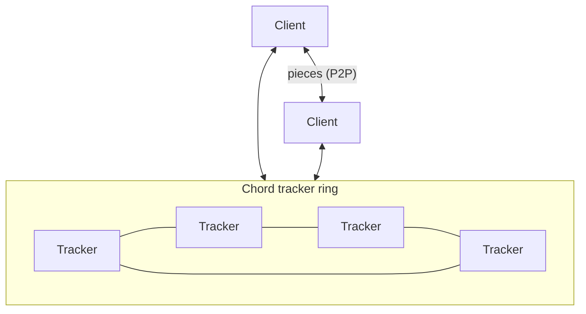

# Distributed BitTorrent

A BitTorrent-style peer-to-peer file-sharing system built on a **Chord distributed hash table**, with fault-tolerant trackers, automatic data replication, and piece-level integrity verification. Both the client and the tracker are Dockerized Python applications with interactive CLIs.

> 📄 A more detailed technical write-up (in Spanish) is available in [`specification.md`](specification.md).

## Architecture



- **Trackers** form a Chord ring that distributes torrent metadata and online-peer records across nodes, giving `O(log N)` lookups without any central coordinator.
- **Clients** query the ring to publish and locate torrents, then download file pieces directly from other peers.

## Key features

### Fault-tolerant Chord ring
- Every tracker maintains a **successor list** (`r = 16`) in addition to its immediate successor. Per the [original Chord paper](https://pdos.csail.mit.edu/papers/chord:sigcomm01/chord_sigcomm.pdf), this keeps lookups correct with high probability even if every node fails with probability 1/2 — covering rings of up to 2¹⁶ nodes.
- **Data replication:** each node replicates its data to all trackers in its successor list. When a node loses its predecessor, it promotes the replicas it holds to owned data; when it gains one, it transfers ownership of the corresponding keys and keeps replicas.

### Piece-based P2P downloads
- Files are split into **256 KB pieces** (configurable per torrent without breaking compatibility — the piece size travels with the torrent metadata).
- Pieces download in **random order from random peers**, spreading piece availability uniformly across the swarm and balancing load between seeders.

### Integrity verification
- Every piece is hash-verified on arrival, and the whole file is verified again before assembly. Corrupt pieces are discarded and re-queued automatically, protecting against both accidental and malicious tampering.

### Custom binary wire protocol
- Requests and torrent pieces travel over a hand-rolled object serialization layer — object-oriented ergonomics without sacrificing bandwidth or performance.

### Peer & server discovery
- **Multicast:** trackers listen on a multicast port so clients and new trackers can find the network with zero configuration on a LAN.
- **Word of mouth:** when a client's known-server list runs low (fewer than 20 by default), it asks servers *and other peers* for trackers they know, spreading knowledge of remote servers through the swarm.

## Repository layout

| Path | Description |
|------|-------------|
| `client/` | Peer client: download/upload logic and interactive CLI |
| `tracker/` | Tracker node, including the Chord implementation (`tracker_chord.py`) |
| `utils/` | Shared code: torrent metadata, request serialization, helpers |
| `makefile` | Build/run targets for single nodes and local clusters |

## Getting started

**Prerequisites:** Docker (plus `make`; on Windows also WSL — `choco install make`).

```bash
# Create the docker network and shared data volume
make prerun

# Start a tracker (or a 5-node local cluster)
make redeploy-tracker
make redeploy-tracker-cluster   # wait ~5s after the first tracker so the ring can form

# Start a client (holder variant mounts the shared data volume for easy seeding)
make redeploy-holder-client
make redeploy-client-cluster    # multiple clients for local swarm testing
```

Interact with any node through its CLI:

```bash
docker attach bittorrent-tracker   # or bittorrent-client, bittorrent-tracker-0, ...
> help
```
